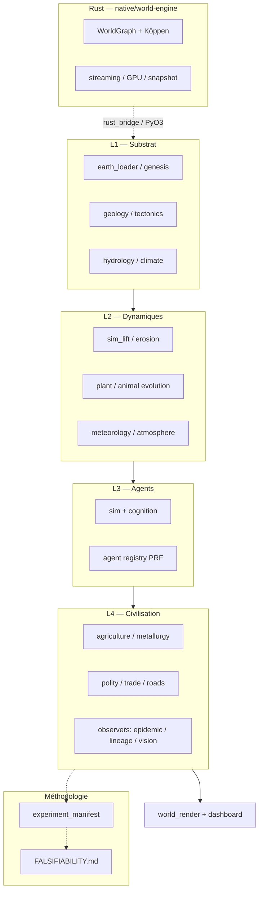

<div align="center">

# Genesis Engine

**Laboratoire de simulation civilisationnelle autonome** — mondes déterministes, agents IA, émergence observée et **réfutable**.

🌐 **Langues** :
[🇫🇷 Français](README.md) · [🇬🇧 English](README.en.md) · [🇪🇸 Español](README.es.md) · [🇩🇪 Deutsch](README.de.md) · [🇵🇹 Português](README.pt.md) · [🇮🇹 Italiano](README.it.md) · [🇨🇳 中文](README.zh-CN.md) · [🇯🇵 日本語](README.ja.md) · [🇷🇺 Русский](README.ru.md) · [🇰🇷 한국어](README.ko.md) · [🇮🇳 हिन्दी](README.hi.md) · [🇳🇱 Nederlands](README.nl.md) · [🇵🇱 Polski](README.pl.md) · [🇸🇦 العربية](README.ar.md)

[](LICENSE)
[](https://www.python.org/)
[](https://rust-lang.org/)
[](docs/ROADMAP-REALISME-TERRE.md)
[](FALSIFIABILITY.md#engine-level-invariants)
[](https://github.com/Micka420-collab/genesis-engine/actions/workflows/ci.yml)

[Vision EMERGENCE SIM v2](docs/EMERGENCE-SIM-v2.md) · [État du projet](PROJECT-STATUS.md) · [Falsifiability ledger](FALSIFIABILITY.md) · [Source-tree canonique](docs/RUNTIME-LAYOUT.md) · [Earth Console](docs/EARTH-CONSOLE.md)

</div>

---

## En une phrase

**EMERGENCE SIM v2** — laboratoire **ZERO PRE-SCRIPT** : seules les lois physiques sont hardcodées. Langage, outils, civilisation, monnaie et effondrement doivent **émerger** des agents — jamais être des quêtes scriptées. Chaque prétention émergente est inscrite dans un ledger réfutable avec sa condition de falsification.

Manifeste complet : **[`docs/EMERGENCE-SIM-v2.md`](docs/EMERGENCE-SIM-v2.md)**

| Layer | Contenu |
|-------|---------|
| **L0** Physics | Thermo, gravité, hydrologie, érosion |
| **L1** World | Genesis, climat (Köppen), biomes, ressources |
| **L2** Biology | ADN 256-D, métabolisme, sélection sexuelle |
| **L3** Cognition | Perception locale, plasticité (NEAT) |
| **L4** Civilization | Commerce, construction, polity, langage |

---

## 🟢 Vérifié et reproductible aujourd'hui

> Tout ce qui suit est ancré dans un smoke vert ou un test pytest qui tourne dans la CI. La règle est : **aucun claim public sans son test correspondant**. Pour les chiffres précis, voir [`NEXT-SPRINT.md`](NEXT-SPRINT.md) et le ledger [`FALSIFIABILITY.md`](FALSIFIABILITY.md).

### Substrat moteur (4 invariants gravés)

| ID | Invariant | Test gardien |
|----|-----------|--------------|
| **I-1** | Même `(seed, config)` → chunks bit-pour-bit identiques (mono- et multi-threadé) | `genesis_streaming::tests::determinism::same_seed_same_chunk_*` |
| **I-2** | Hash NaN-safe cross-plateforme dans tout `ContentAddressable` | `genesis_worldgraph::pass::hash_helper_tests::*` |
| **I-3** | Coalescing concurrent : 1 seul `generate()` pour N callers parallèles sur le même coord (panic-safe via RAII) | `genesis_streaming::tests::concurrent_get_or_generate_coalesces_to_one_generation` |
| **I-4** | Chunks mutés survivent à l'éviction et au snapshot/restore | `genesis_agent_api::tests::mutated_chunks_survive_eviction_pressure` |

Chaque échec de `I-*` suspend toutes les claims émergentes de [`FALSIFIABILITY.md`](FALSIFIABILITY.md) — c'est la fondation, pas un bonus.

### Émergence observée (smokes verts)

- **173 tests pytest** (`make test-python`) — 42 fichiers `runtime/tests/test_*.py` (dont 15 nouveaux pour l'infra `experimental_run`)
- **17 smokes** dans `make validate-all` (p72–p87), **116 smokes** livrés au total (`p0`–`p112`, certains gated par la wheel Rust)
- **Waves 1–41** intégrées au tick principal — index dans [`docs/sprints/README.md`](docs/sprints/README.md)

Quelques chiffres-clés mesurés par leurs smokes (cf. [`NEXT-SPRINT.md`](NEXT-SPRINT.md) sessions 34*) :

| Phénomène émergent | Mesure observée | Smoke gardien | Wave |
|--------------------|-----------------|---------------|------|
| Coefficient consanguinité (Wright F, incest siblings) | **exactement 0.2500** | `p71_lineage_observer_smoke` 9/9 | 40 |
| R₀ épidémique sur réseau de contact | **0.750** (cholera empirique) | `p70_epidemic_observer_smoke` 9/9 | 39 |
| Polities émergentes (gouvernance locale) | observable cross-seed | `p32_polity_smoke` PASS | 32 |
| Diffusion culturelle (memetic) | gradient mesurable | Wave 31 (smokes session 34o) | 31 |
| Réseau de routes par footprints | densité corrélée biome | Wave 29 (smokes session 34m) | 29 |
| Anatomie + blessures + sang 5L | 10 body parts × 4 wound kinds | Wave 34 (smokes session 34r) | 34 |
| Atmosphère temporelle (saisons + solaire) | day_PNG ≠ night_PNG byte-different | `p72_world_atmosphere_smoke` 9/9 | 41 |

**Non-régression actuelle : 31 smokes consécutifs verts (p44–p72)** au snapshot du 2026-05-18 (NEXT-SPRINT session 34z).

### Réalisme Terre — score chiffré par dimension

**Score global : ~76 %** (moyenne 7 dimensions). Cible : **80 %**. Source de vérité unique : [`docs/ROADMAP-REALISME-TERRE.md`](docs/ROADMAP-REALISME-TERRE.md).

| Dimension | % | Piste principale |
|-----------|---|------------------|
| Climat / biomes | 80 | GraphCast-lite + colonne 3D + circulation L1 |
| Géologie / relief | 55 | Tectonique live, stratigraphie légère |
| Écologie / hydrologie | 68 | `hydrology_mode` sv1d ; Earth Console overlay |
| Sociétés / agents | 76 | NEAT + construction émergente + memetic |
| Rendu visuel | 82 | Globe + iso 2.5D + ombres + atmosphère |
| Observation IA | 86 | Earth Console SSE, replay, WebGPU |
| Pont Python ↔ Rust | 82 | GENM + mutations write-back + snapshot |

### Infra scientifique (méthodologie Cluster C)

- **`experimental_run`** (`runtime/engine/experiment_manifest.py`) — capture provenance (git commit, sha256 du `pyproject.toml`, version Python, plateforme), timing, `world.summary()`, **state_fingerprint SHA-256**. Manifest écrit même sur crash. 14 tests.
- **`PREREGISTRATION_TEMPLATE.md`** ([`runtime/experiments/`](runtime/experiments/PREREGISTRATION_TEMPLATE.md)) — déclaration hypothèse + prédictions chiffrées + conditions d'arrêt **avant** le run.
- **[`FALSIFIABILITY.md`](FALSIFIABILITY.md)** — ledger poppérien : confirmed / pending / null / refuted / superseded + 4 invariants moteur `I-*`.

### Source-tree canonique

- **Python runtime** : [`runtime/engine/`](runtime/engine/) (package officiel, `pyproject.toml` setuptools)
- **Rust workspace canonique** : [`native/world-engine/`](native/world-engine/) — 22 crates, build wheel `genesis_world` via `make maturin-dev`
- **Rust workspace legacy** : `scaffolding/crates/` (toujours utilisé par les smokes p88-p112, migration B planifiée Q3 2026)
- **Décision complète + conflit deux-wheels documenté** : [`docs/RUNTIME-LAYOUT.md`](docs/RUNTIME-LAYOUT.md)

---

## 🟡 En cours

| Travail | Statut | Référence |
|---------|--------|-----------|
| **Wave 42** — Rust↔Python integration (PyO3 wheel `genesis_world`) | actif | `runtime/engine/rust_bridge.py` + `make maturin-dev` |
| **Phase 5 Genesis-α** (long-run public, LLM tier-2) | 9/10 prérequis livrés — GO/NO-GO **2026-06-02** | `../Genesis_Engine_2026-05-23_Phase5_Unlock_Brief.md` |
| **Migration B** — absorber `scaffolding/ge-py` (1762 l) dans `native/world-engine/pybindings` (369 l) | scoping (3 mois) | [`docs/RUNTIME-LAYOUT.md`](docs/RUNTIME-LAYOUT.md) §2.3 |
| **Réalisme 76 % → 80 %** | géologie (55→70), hydrologie cross-chunk | [`docs/ROADMAP-REALISME-TERRE.md`](docs/ROADMAP-REALISME-TERRE.md) |
| **Délétion code mort** : `runtime/genesis/` (ImportError), `runtime-phase5/` (fork archéologique) | prêt, attend OK destructif | [`docs/RUNTIME-LAYOUT.md`](docs/RUNTIME-LAYOUT.md) §3 |

---

## 🟠 Hypothèses (à tester, **PAS** prouvées)

Mécanismes que le projet *cherche* à faire émerger. Aucun de ces points ne peut être cité comme "fait" tant qu'un run préenregistré ne l'a pas validé dans [`FALSIFIABILITY.md`](FALSIFIABILITY.md).

- **Monnaie endogène** : un item devient médian d'échange via observation des trades — *aucun hardcode "le sel est la monnaie"*.
- **Spécialisation des métiers** : skill accumulation × opportunity cost → distribution actions-par-agent dont l'entropie chute mesurablement.
- **Effondrement Tainter** : rendements marginaux décroissants → refus de BUILD/INVENT, retour à la subsistance.
- **Sélection sexuelle** : courtship + `mate_preference` dérivée de Big-Five → corrélation parents-enfants observable sur traits visibles.
- **Bulles épistémiques** : COMMUNICATE avec `veracity ∈ [0,1]` + consistency check → clusters de confiance émergents, liars isolés.
- **Niche construction bidirectionnelle** : feu de camp déboise, agriculture épuise le sol, urbain bloque le runoff → pression sélective sur les agents.

Pour ajouter un test : copier [`PREREGISTRATION_TEMPLATE.md`](runtime/experiments/PREREGISTRATION_TEMPLATE.md), remplir avant le run, lancer avec `experimental_run`, inscrire le `state_fingerprint` dans [`FALSIFIABILITY.md`](FALSIFIABILITY.md) si la prédiction tient sur ≥ 3 seeds.

---

## Architecture



Détail Rust : [`native/world-engine/README.md`](native/world-engine/README.md) · ADR & specs : [`adr/`](adr/), [`architecture/`](architecture/), [`specs/`](specs/).

---

## Démarrage rapide

### Prérequis logiciels

- **Python 3.11–3.13**
- **Optionnel** : Rust 1.85+ (`rustup`) pour `native/world-engine`
- **Optionnel** : `rasterio` + `pyproj` pour Terre réelle (`pip install -e ".[earth]"`)

### Configuration matérielle

Le cœur de la simulation est **CPU-bound et déterministe** (single-thread pour la reproductibilité bit-pour-bit, multi-thread pour le streaming de chunks). Le GPU n'est utile que pour le **rendu / l'Earth Console** (WebGPU), jamais pour la physique.

| Ressource | Minimum (faire tourner) | Recommandé (confort + runs longs) | Rendu réaliste (max) |
|-----------|-------------------------|-----------------------------------|----------------------|
| **OS** | Windows 10/11, Linux x86-64, macOS 12+ | idem 64 bits récent | idem 64 bits récent |
| **CPU** | 2 cœurs / 4 threads @ ~2 GHz | 8 cœurs+ @ 3 GHz+ (chunks parallèles, runs ≥ 10⁵ ticks) | 16 cœurs+ @ 4 GHz+ (génération monde + tick + encodage frames en parallèle) |
| **RAM** | **4 Go** (petit monde ~2 km, ≤ 50 fondateurs) | **16 Go+** (mondes larges, biosphère `origins`, snapshots) | **32–64 Go** (planète quasi-complète, agents nombreux, replay long en mémoire) |
| **VRAM / GPU** | aucun (rendu CPU / headless OK) | GPU WebGPU (Vulkan/Metal/DX12) pour globe 2.5D + Earth Console fluide | **GPU dédié 8–16 Go VRAM** (globe + iso 2.5D + ombres + atmosphère à haute résolution, 60 fps) |
| **Disque** | **~2 Go** libres (dépôt + venv + wheels) | **10 Go+** SSD (experiments, renders, manifests, replays) | **50 Go+ NVMe** (séquences de frames 4K, vidéos, replays archivés) |
| **Affichage** | n/a (headless) | 1080p | 1440p / 4K (globe + overlays Earth Console) |
| **Réseau** | requis seulement à l'install (`pip`, `cargo`) | idem | idem |

Notes :
- **Sans Rust ni GPU**, le moteur Python tourne intégralement (les smokes gatés par la wheel `genesis_world` sont simplement sautés). C'est la config minimale viable.
- La **physique reste CPU-bound et déterministe** : un GPU plus puissant n'accélère **jamais** la simulation, il ne sert qu'au **rendu**. La colonne « Rendu réaliste (max) » vise le pipeline visuel complet (globe + iso 2.5D + ombres + atmosphère temporelle — Wave 41) à haute résolution et framerate stable.
- La **RAM est le facteur limitant côté simulation** : elle croît avec la taille du monde (`size_km`), le nombre d'agents (`founders`) et la durée du run (chunks mutés conservés en mémoire — invariant **I-4**).
- La **VRAM est le facteur limitant côté rendu** : globe haute résolution + overlays + ombres + atmosphère. En dessous de ~8 Go, baisser la résolution ou désactiver des couches de l'Earth Console.
- Pour la **biosphère 100 % émergente** (`run.py origins`) et les **runs préenregistrés ≥ 1000 ticks**, viser au moins la colonne recommandée.

#### ⚠ Cible hypothétique — 3D / 4D photoréaliste (PAS encore implémenté)

> **État réel aujourd'hui** : le rendu est un **globe + iso 2.5D** avec ombres et atmosphère temporelle (Wave 41), à un réalisme Terre **~76 %**. Il n'existe **aucun rendu 3D volumétrique ni d'humains photoréalistes** — c'est une cible, pas une fonctionnalité. Conformément à la règle du projet (« aucun claim sans son test »), ce qui suit est une **estimation matérielle prospective**, à ne citer nulle part comme « fait ».

Ce qu'impliquerait une telle cible et le matériel correspondant :

| Étage | Ce que ça suppose d'ajouter | Matériel estimé |
|-------|------------------------------|-----------------|
| **3D** (volumétrique) | Maillage planétaire LOD, terrain déplacé, eau/nuages volumétriques, path-tracing temps réel | **GPU 24–48 Go VRAM** (RTX 4090 / 6000 Ada classe), 64–128 Go RAM |
| **4D** (3D + temps réel-continu) | Le « D » temporel existe déjà partiellement (saisons/solaire Wave 41) — l'étendre à une trajectoire 3D rejouable image par image | + stockage **NVMe 1 To+** pour les séquences/replays, débit ≥ 3 Go/s |
| **Humains photoréalistes** | Avatars du corps d'agent (déjà : anatomie + blessures + sang 5 L, Wave 34) → skinning, neural rendering / Gaussian splatting | **Multi-GPU** ou render-farm ; VRAM **48 Go+** par nœud |
| **Échelle « vraie Terre »** | Planète entière à résolution humaine = explosion mémoire/chunks (invariant I-4) | **Cluster** (RAM 256 Go+ agrégée, stockage objet) — hors poste de travail unique |

En clair : le **substrat agent existe déjà** (corps, métabolisme, cognition NEAT, émergence), mais le **rendu photoréaliste 3D/4D est un axe de recherche graphique non commencé**. Le passer de 2.5D à 3D volumétrique photoréaliste est un chantier à part entière, indépendant de la simulation — qui, elle, resterait **CPU-bound et déterministe**.

### Installation

```bash
git clone https://github.com/Micka420-collab/genesis-engine.git
cd genesis-engine
python -m venv .venv
# Windows: .venv\Scripts\activate
# Linux/macOS: source .venv/bin/activate
python -m pip install -U pip
python -m pip install -e ".[dev]"
# Terre réelle :
# python -m pip install -e ".[earth,dev]"

make doctor          # outils + imports
make smoke           # p0 — doit finir par PASSED
make test-python     # 173 tests pytest
make validate-all    # smokes p72–p87 + SSE
```

### Hello World (30 s)

```python
from engine.world_builder import WorldBuilder

world = (
    WorldBuilder("demo")
    .anchor(46.51, 6.63)
    .size_km(2.0)
    .founders(20)
    .with_realism()
    .build()
)
world.run(500)
print(world.summary())
```

### Run reproductible (recommandé pour toute validation d'hypothèse)

```bash
PYTHONPATH=runtime python runtime/scripts/civilization_pipeline.py \
    --experiment baseline-lausanne \
    --seed 0xC1A71CE0 --ticks 1000 --founders 12
```

Produit `runtime/experiments/baseline-lausanne_<UTC>/{manifest.json, summary.json}` avec provenance complète (git commit, hash `pyproject.toml`, platform, timing) + `state_fingerprint` SHA-256 citable dans `FALSIFIABILITY.md`. Voir [`CONTRIBUTING.md`](CONTRIBUTING.md) §"Runs longs".

### Biosphère 100 % émergente

```bash
cd runtime
python run.py origins
```

Pas de fondateurs scriptés : substrat → protocellules → cyanobactéries → O₂ → faune → primates → ≤2 sapients. Documentation : [`docs/BIOSPHERE-EMERGENCE.md`](docs/BIOSPHERE-EMERGENCE.md).

### Rust (world-engine)

```bash
cd native/world-engine
cargo test                                    # core + nouveaux invariants I-*
cargo run --release -p genesis-streaming --example demo_world
make maturin-dev                              # wheel `genesis_world` (depuis racine)
```

---

## Structure du dépôt

```
genesis-engine/
├── runtime/                            # ✅ Canonique Python
│   ├── engine/                         #    package officiel
│   ├── scripts/                        #    smokes p0…p112
│   ├── tests/                          #    158 tests pytest
│   ├── experiments/                    #    PREREGISTRATION_TEMPLATE + runs
│   └── run.py                          #    launcher unifié
├── native/world-engine/                # ✅ Canonique Rust (22 crates)
│   └── crates/pybindings/              #    wheel `genesis_world`
├── scaffolding/                        # ⚠ Legacy Rust (migration B en cours)
│   └── crates/ge-py/                   #    wheel concurrente — cf RUNTIME-LAYOUT.md
├── docs/
│   ├── RUNTIME-LAYOUT.md               #    📜 source de vérité source-tree
│   ├── ROADMAP-REALISME-TERRE.md       #    📊 grille réalisme par dimension
│   ├── EMERGENCE-SIM-v2.md             #    📜 manifeste produit
│   ├── audits/                         #    audits archivés
│   └── sprints/                        #    journaux session-par-session
├── FALSIFIABILITY.md                   # 🔬 ledger poppérien (invariants + claims)
├── PROJECT-STATUS.md                   # synthèse statut
├── NEXT-SPRINT.md                      # file de priorités
├── ROADMAP.md                          # phases produit 0–5
├── CONTRIBUTING.md  ETHICS.md  SECURITY.md
└── pyproject.toml  Makefile  LICENSE
```

Arborescence runtime détaillée : [`runtime/README.md`](runtime/README.md). Décisions historiques : [`docs/OBSOLETE.md`](docs/OBSOLETE.md).

---

## Méthodologie scientifique

1. **Tout run > 1000 ticks visant une hypothèse** passe par `experimental_run` (cf. [`CONTRIBUTING.md`](CONTRIBUTING.md) §"Runs longs").
2. **Toute prétention émergente publique** doit être inscrite dans [`FALSIFIABILITY.md`](FALSIFIABILITY.md) avec sa condition de réfutation chiffrée, *avant* d'être citée dans une présentation ou un préprint.
3. **Confirmation** demande ≥ 3 seeds distincts produisant le même observable au-delà du seuil de réfutation, sur le même git commit.
4. **Aucun retro-fit** : la préenregistration doit être committée **avant** le run. Le graphe git est l'audit trail.

---

## Déterminisme — règle d'or

Même `(seed, config, région)` → même monde et même trajectoire. Validation par SHA-256 sur `world.summary()` (cf. `state_fingerprint`). Source unique d'aléa : `engine.core.prf_rng`.

Les invariants moteur `I-1`…`I-4` (cf. [`FALSIFIABILITY.md`](FALSIFIABILITY.md)) sont couverts par des tests Rust, mais leur niveau d'application en CI diffère aujourd'hui :

- **`I-2`** (hash NaN-safe dans `worldgraph`) tourne dans le job **bloquant** `cargo test (core, biome, worldgraph)` — un échec casse la CI.
- **`I-1`, `I-3`, `I-4`** (crates `streaming` / `agent-api`) tournent dans le job `cargo test (extended workspace)` actuellement marqué `continue-on-error: true` dans [`.github/workflows/ci.yml`](.github/workflows/ci.yml). Ils sont donc **advisory** (un échec est rapporté mais ne casse pas la CI), en attendant la levée du `continue-on-error` après un `cargo test` vert local. Tant que ce flag est présent, ne pas les présenter comme garantis par la CI.

---

## Contribuer

Le projet accueille chercheurs alife, ingénieurs Python/Rust, géographes et contributeurs doc.

1. Lire [`CONTRIBUTING.md`](CONTRIBUTING.md) (matrice « où coder », règle PRF, méthodologie expérimentale).
2. Fork → branche `feature/...` ou `fix/...`.
3. `make smoke` + smokes liés à ton domaine.
4. Pour les runs hypothèse-pilotés : préenregistrer via [`PREREGISTRATION_TEMPLATE.md`](runtime/experiments/PREREGISTRATION_TEMPLATE.md).
5. Pull Request (template : [`.github/PULL_REQUEST_TEMPLATE.md`](.github/PULL_REQUEST_TEMPLATE.md)).

**Règle d'or** : pas de `random.*` non seedé — uniquement `engine.core.prf_rng`. Pas d'imports inline en milieu de fichier.

---

## Licence

[AGPL-3.0](LICENSE) — utilisation, modification et redistribution libres ; obligation de partager les sources si vous hébergez le moteur en service.

---

## Crédits

Conçu et maintenu par [Micka Delcato](https://github.com/Micka420-collab). Architecture mai 2026.
