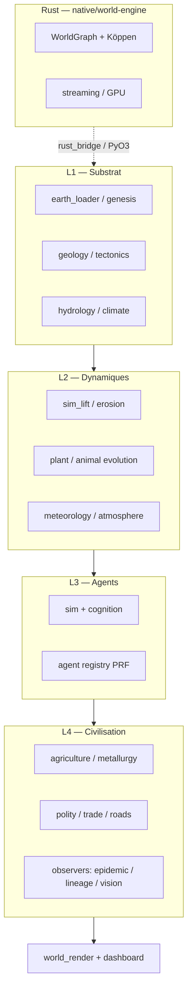

<div align="center">

# Genesis Engine

**Laboratoire de simulation civilisationnelle autonome** — mondes déterministes, agents IA, émergence observée.

🌐 [Français](README.md) · [English](README.en.md) · [Español](README.es.md) · [中文](README.zh-CN.md) · [العربية](README.ar.md)

[](LICENSE)
[](https://www.python.org/)
[](docs/ROADMAP-REALISME-TERRE.md)
[](#déterminisme)
[](https://github.com/genesis-engine/genesis-engine/actions/workflows/ci.yml)

[État du projet](PROJECT-STATUS.md) · [Contribuer](CONTRIBUTING.md) · [Runtime Python](runtime/README.md) · [Moteur Rust](native/world-engine/README.md) · [Documentation](docs/README.md)

</div>

---

## Vision

Genesis Engine est un **laboratoire open-source d’artificial life** : à partir d’un substrat physique cohérent (Terre réelle ou procédural) et de règles minimales, des agents autonomes naissent, se reproduisent et font émerger langage, économie, bâtiments et politiques — **sans scripts de fin de partie**. L’objectif scientifique est de rejouer des contrefactuelles de l’histoire humaine sous les mêmes lois de la nature ([`FUTURE-VISION.md`](FUTURE-VISION.md)).

### Émergence civilisationnelle (philosophie d’implémentation)

Climat Köppen, hydrologie, épidémies, observation et civilisation **ne sont pas pilotés par des pipelines de scripts** : ils sont branchés sur le cycle de vie de `Simulation` (`sim.step()`, `engine/sim_emergence.py`). Les smokes et `make smoke` servent à **valider** ; l’entrée utilisateur est `python runtime/run.py <expérience>` ou une boucle `sim.step()` en direct. Voir [`PROJECT-STATUS.md`](PROJECT-STATUS.md#philosophie--émergence-civilisationnelle).

---

## Où en est le projet ?

| Axe | Statut | Détail |
|-----|--------|--------|
| Phases 0–2 (vie, société) | ✅ | Cognition, reproduction, lexique |
| Phase 4 (émergence civ.) | ✅ | Agriculture, écriture, polity, métallurgie |
| Phase 5 (Genesis-α) | ⏳ | Long-run 10k sim-yr en cours |
| **Waves 16–41** (monde réaliste) | ✅ | Genesis → climat → settlements → render → atmosphère → observateurs |
| **Réalisme Terre (global)** | **~68 %** | Grille par dimension → [`docs/ROADMAP-REALISME-TERRE.md`](docs/ROADMAP-REALISME-TERRE.md) |

Synthèse maintenue : **[`PROJECT-STATUS.md`](PROJECT-STATUS.md)** · file de travail : **[`NEXT-SPRINT.md`](NEXT-SPRINT.md)**.

### Capacités phares (runtime Python)

| Domaine | Exemples livrés |
|---------|-----------------|
| Substrat | Earth-anchored (Copernicus + WorldCover), géologie 36 minéraux, hydrologie D8 |
| Bio | Photosynthèse Farquhar, 39 clades végétaux, 47 espèces Lotka-Volterra |
| **Biosphère émergente** | Protocellules → microbes → faune → sapients ([`docs/BIOSPHERE-EMERGENCE.md`](docs/BIOSPHERE-EMERGENCE.md)) |
| Civilisation | Métallurgie émergente, bâtiments par statics, écriture sur matériaux vieillissants |
| Monde & rendu | `GenesisWorld` (W16+), hillshade / iso (W27/36), atmosphère jour/nuit (W41) |
| Infra | Persistance SHA-256, time-warp, dashboard `/api/*`, exports GeoTIFF/PNG/OBJ |

---

## Architecture



- **Spec contractuelle** : [`Genesis_Engine_Architecture_v1.0.docx`](Genesis_Engine_Architecture_v1.0.docx) (53 sections)
- **ADR & specs** : [`adr/`](adr/), [`architecture/`](architecture/), [`specs/`](specs/)
- **Rust détaillé** : [`architecture/world-engine-rust.md`](architecture/world-engine-rust.md)

---

## Démarrage rapide

### Prérequis

- **Python 3.12+** (3.13 recommandé)
- **Optionnel** : Rust 1.85+ (`rustup`) pour `native/world-engine`
- **Optionnel** : `rasterio` + `pyproj` pour Terre réelle (`pip install -e ".[earth]"`)

### Installation

```bash
git clone https://github.com/Micka420-collab/genesis-engine.git
cd genesis-engine
python -m venv .venv
# Windows: .venv\Scripts\activate
# Linux/macOS: source .venv/bin/activate
python -m pip install -U pip
python -m pip install -e ".[dev]"
# Terre réelle :
# python -m pip install -e ".[earth,dev]"

make doctor
make smoke          # p0 — doit finir par PASSED
make test-python
```

`PYTHONPATH` : le package `engine` vit sous `runtime/`. Les commandes `make` et `pytest` le configurent ; en manuel :

```bash
# Windows PowerShell
$env:PYTHONPATH = "runtime"
python runtime/scripts/p0_smoke.py

# Linux/macOS
PYTHONPATH=runtime python runtime/scripts/p0_smoke.py
```

### Hello World (30 s)

```python
from engine.world_builder import WorldBuilder

world = (
    WorldBuilder("demo")
    .anchor(46.51, 6.63)
    .size_km(2.0)
    .founders(20)
    .with_realism()
    .build()
)
world.run(500)
print(world.summary())
```

### Philosophie : émergence civilisationnelle

Rien de « scripté » en fin de partie : climat Köppen, hydrologie des chunks,
graphe de contacts épidémiques et exports observables doivent **émerger du
même monde** que les agents (`bootstrap_genesis_sim` → ticks → observers).
Le pipeline déterministe `runtime/scripts/civilization_pipeline.py`
(`make civilization`) enchaîne bootstrap, coupler multi-taux, simulation et
manifeste FAIR — pas de grille macro factice sauf opt-in `--synthetic-only`.

### Biosphère 100 % émergente (`origins`)

```bash
cd runtime
python run.py origins
```

Pas de fondateurs scriptés : substrat → protocellules → cyanobactéries → O₂ → faune
→ primates → ≤2 sapients. Documentation : [`docs/BIOSPHERE-EMERGENCE.md`](docs/BIOSPHERE-EMERGENCE.md).

### Smokes récents (réalisme session mai 2026)

```bash
make civilization          # pipeline complet + artifacts/
make validate-fair         # Köppen FAIR + checksums
make observe               # dashboard + SSE
cd runtime && python scripts/p82_civilization_pipeline_smoke.py
PYTHONPATH=runtime python -m pytest runtime/tests/test_life_emergence.py -q
```

### Rust (world-engine)

```bash
cd native/world-engine
cargo test
cargo run --release -p genesis-streaming --example demo_world
```

Voir [`native/world-engine/README.md`](native/world-engine/README.md).

---

## Structure du dépôt

```
genesis-engine/
├── runtime/                 # Simulation Python (package engine)
│   ├── engine/              # Modules sim, monde, civilisation, rendu
│   ├── scripts/             # Smokes p0 … p79, démos
│   └── tests/               # pytest
├── native/world-engine/     # Moteur Rust (WorldGraph, biome, streaming)
├── scaffolding/             # Crates Rust historiques (ECS proto)
├── docs/                    # Index doc, sprints, renders, roadmap réalisme
├── architecture/ adr/ specs/ ethics/ ops/   # Specs & gouvernance
├── PROJECT-STATUS.md        # Synthèse statut (ce qu’il faut lire en premier)
├── NEXT-SPRINT.md           # Journal de priorités détaillé
├── CONTRIBUTING.md          # Guide contributeur
└── README.md                # Ce fichier
```

**Arborescence détaillée runtime** : [`runtime/README.md`](runtime/README.md).

---

## Documentation

| Document | Rôle |
|----------|------|
| [`docs/README.md`](docs/README.md) | Index de toute la documentation |
| [`docs/sprints/README.md`](docs/sprints/README.md) | Historique des sessions (Waves, phases) |
| [`docs/ROADMAP-REALISME-TERRE.md`](docs/ROADMAP-REALISME-TERRE.md) | Grille réalisme ~63 % + commandes vérif |
| [`ROADMAP.md`](ROADMAP.md) | Phases produit 0–5 |
| [`ETHICS.md`](ETHICS.md) · [`SECURITY.md`](SECURITY.md) | Gouvernance |

**Renders** (ne pas supprimer sans accord) : [`docs/compliance/renders/`](docs/compliance/renders/), [`docs/renders/`](docs/renders/).

---

## Contribuer

Le projet accueille chercheurs alife, ingénieurs Python/Rust, géographes et contributeurs doc.

1. Lire **[`CONTRIBUTING.md`](CONTRIBUTING.md)** (premier jour, matrice « où coder », déterminisme PRF).
2. Fork → branche `feature/...` ou `fix/...`.
3. `make smoke` + smokes liés à ton domaine.
4. Pull Request (template dans [`.github/PULL_REQUEST_TEMPLATE.md`](.github/PULL_REQUEST_TEMPLATE.md)).

**Règle d’or** : pas de `random.*` non seedé — uniquement `engine.core.prf_rng`. Pas d’imports inline en milieu de fichier.

---

## Déterminisme

Même `(seed, config, région)` → même monde et même trajectoire. Validation par SHA-256 sur états agents ; smokes `p0`, `p12`, et vagues `p44+` vérifient la reproductibilité.

---

## Licence

[AGPL-3.0](LICENSE) — utilisation, modification et redistribution libres ; obligation de partager les sources si vous hébergez le moteur en service.

---

## Crédits

Conçu et maintenu par [Micka Delcato](https://github.com/Micka420-collab). Architecture mai 2026.
