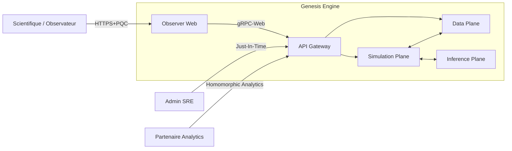
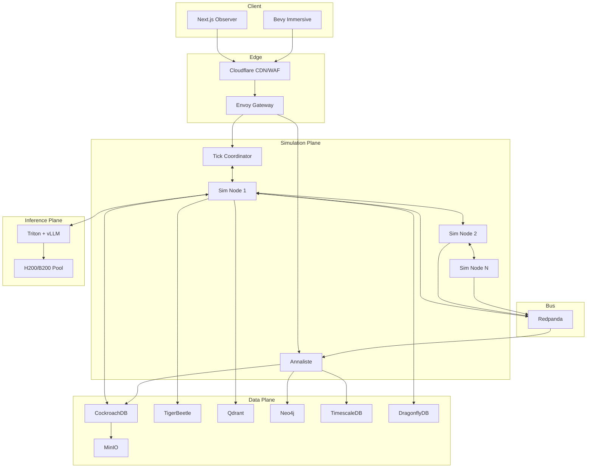
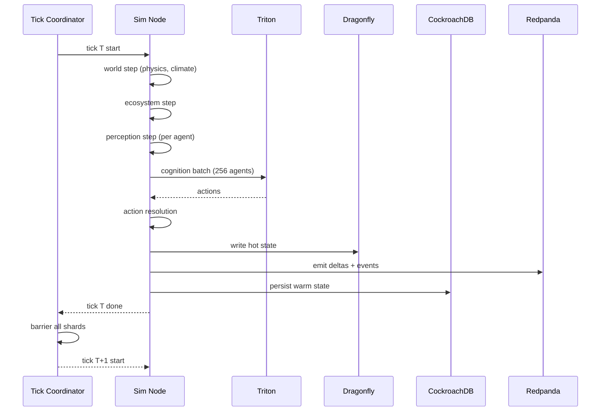
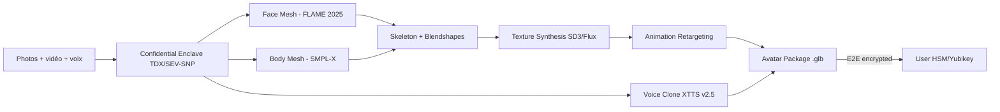
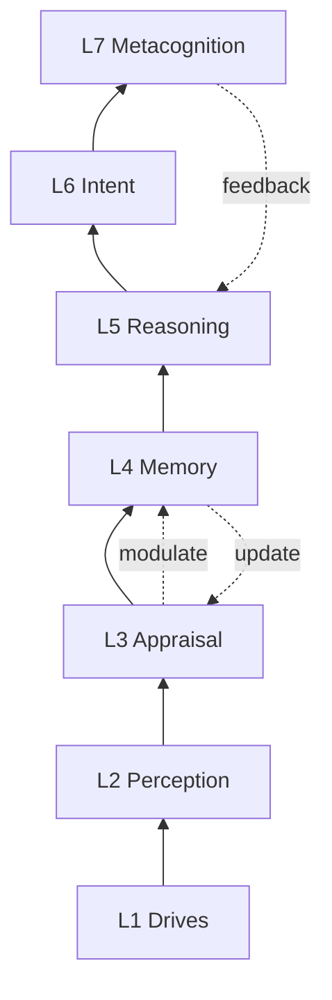
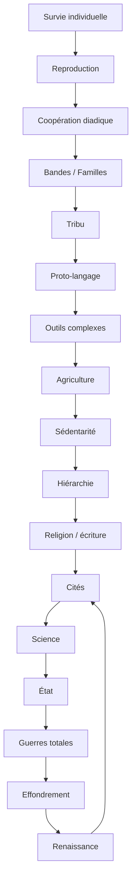
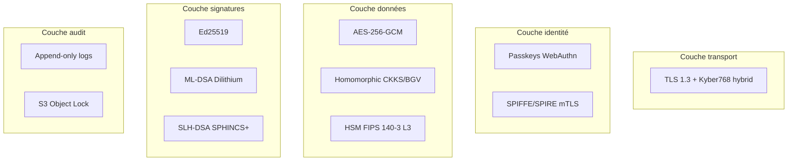

# Diagrammes d'architecture (Mermaid)

## C1 — Contexte système

## C2 — Conteneurs

## Cycle de tick

## Pipeline avatar utilisateur

## Pile cognitive d'un agent

## Arbre de civilisation émergente

## Plans de sécurité (couches)

