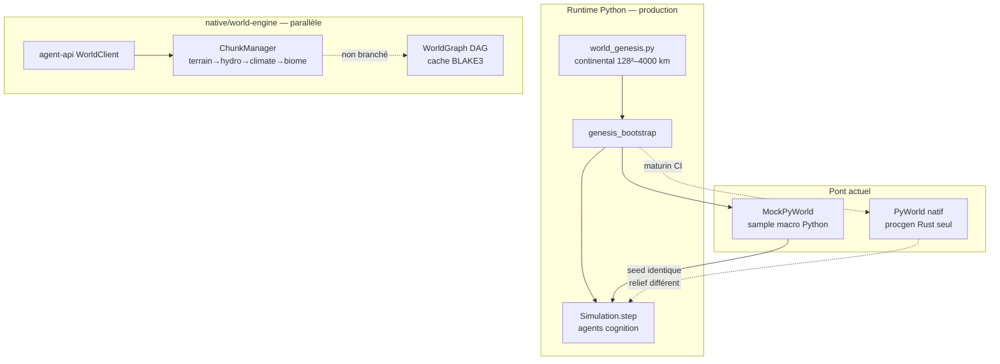
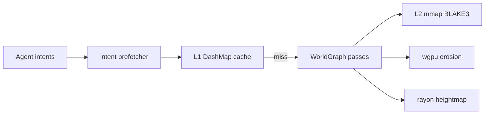
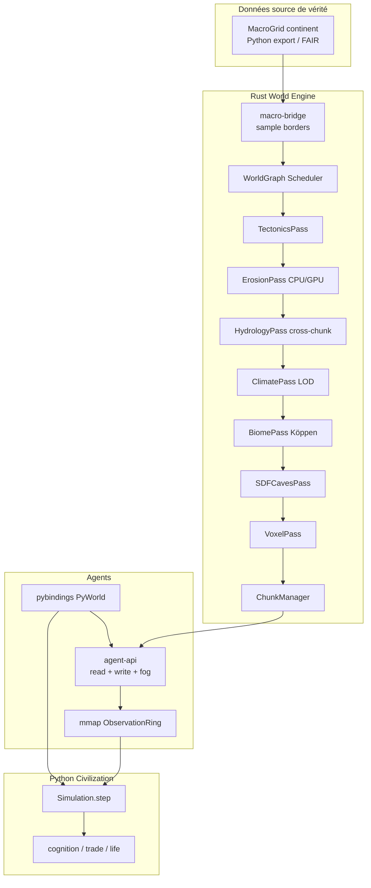

# God-Engine — Architecture « créer la Terre »

**Audience :** ingénieur moteur senior · **Repo :** `genesis-engine` · **Date :** mai 2026  
**Référence code :** `native/world-engine/NEXT-LEVEL-AUDIT.md`, `proposals/`, `runtime/engine/world_genesis.py`

---

## 0. Verdict en une phrase

Vous avez **deux moteurs** qui coexistent : un **continent Python** (Genesis, climat, civilisation, Earth Console) aligné sur le **réalisme global ~76 %** ([`ROADMAP-REALISME-TERRE.md`](ROADMAP-REALISME-TERRE.md)), et un **pont Rust** (GENM, agent-api, Köppen) à **~82 %** sur la dimension « intégration » — le **chunk procgen Rust seul** reste ~45 % tant qu’il n’est pas la vérité géographique unique. Le saut « dieu qui crée la Terre » ne passe pas par plus de bruit — il passe par **une seule vérité géographique**, des **passes multi-échelles couplées**, et une **API agent déterministe avec écriture réelle**.

---

## 1. Audit du moteur actuel

### 1.1 Cartographie dual-stack



| Composant | Implémenté | Stub / gap | Fichier clé |
|-----------|------------|------------|-------------|
| Tectonique plaques | ✅ Python (Voronoi + uplift) | Rust : Voronoi **statique**, `motion` non utilisé | `world_genesis.py`, `terrain/tectonics.rs` |
| Érosion hydraulique | ✅ Python (40 iter stream-power) | Rust CPU ; **bords chunk** ; GPU **non câblé** | `erosion.rs:50-52`, `gpu/` |
| Climat / vents | ✅ Python (Hadley, orographic) | Rust : 3 bandes lat, pas d'advection | `climate/src/lib.rs` |
| Hydrologie | 🟡 sv1d/lbm cross-chunk Python | Rust D8 **par chunk** | `chunk_hydrology.py`, `hydrology/` |
| Biosphère / agents | ✅ Python (life_emergence, cognition) | Rust ecosystem = **seeds only** | `animal_evolution.py`, `ecosystem/` |
| API agents lecture | ✅ Python + Rust `WorldView` | — | `agent_observation.py`, `agent-api/` |
| API agents **écriture** | ✅ Python (BUILD, terrain) | Rust `apply_pending` → **write-back** `RwLock<Chunk>` | `streaming` + `agent-api` |
| WorldGraph prod | ✅ DAG + scheduler | **Bypass** par `ChunkManager::generate` | `streaming/manager.rs` |
| Déterminisme | ✅ PRF / seed | **Deux pipelines ≠ même relief** | `rust_bridge.py` |
| 10k entités @ 60fps | 🟡 Python ~200 agents | Rust pas sur boucle gameplay | `sim.py`, benchmarks |

### 1.2 Top 10 bottlenecks critiques

| # | Bottleneck | Impact | Preuve |
|---|------------|--------|--------|
| **B0** | ~~Double vérité monde~~ → **P0.2–0.3 livré** (GENM + `align_heightmap`) | Rust chunks pinent la macro Python aux bordures | `macro_grid_export.py`, `macro-bridge`, `streaming/manager.rs` |
| **B1** | Tectonique sans cinématique temporelle | Pas de cycle Wilson, subduction | `tectonics.rs` — `motion` jamais intégré |
| **B2** | Érosion / rivières coupées aux frontières chunk | Artefacts « rivière fantôme » | `erosion.rs` break border |
| **B3** | Climat analytique, pas de LOD météo | Saisons / tempêtes impossibles en Rust | `climate/src/lib.rs` |
| **B4** | Écosystème = placement, pas simulation | Pas de chaîne alimentaire native | `ecosystem/src/lib.rs` |
| **B5** | ~~Mutations stub~~ → **P5 livré** (write-back + snapshot + mesh L2) | RL checkpoints OK | `SharedChunk`, `WorldSnapshot` |
| **B6** | WorldGraph hors hot path | Cache lineage inutilisé en prod | `worldgraph_demo.rs` only |
| **B7** | GPU erosion isolée | Perf x3–x5 non récupérée | `gpu/` feature non default |
| **B8** | `bevy_ecs` déclaré, **jamais utilisé** | 10k entités non structurées en Rust | `Cargo.toml` workspace |
| **B9** | Pas de SDF 3D / grottes | Exploration souterraine absente | `proposals/axis1_geology/sdf_caves.rs` |
| **B10** | Pas de snapshot monde complet pour RL | Training impossible sur état natif | `proposals/axis5_agent_api/snapshot.rs` |

### 1.3 Benchmarks existants (référence)

| Mesure | Cible documentée | Source |
|--------|------------------|--------|
| Bruit 256² scalar | **62 ms** (2.3× vs Perlin) | `BENCHMARKS.md` |
| Chunk complet 64³ | **5–8 ms** CPU | `BENCHMARKS.md` |
| GPU erosion | **~1.5 ms** / passe | `BENCHMARKS.md`, `gpu/tests/` |
| ECS 100k entités | bevy_ecs **240 iter/s** | `BENCHMARKS.md` (non intégré) |
| Déterminisme chunk | BLAKE3 hash match | `streaming/tests/determinism.rs` |

**Heightmap classique vs tectonique dynamique :** une heightmap FBM seule est **O(1)** par sample et ~2× plus rapide, mais **ne produit pas** dorsales, bassins sédimentaires ni failles cohérentes. La cible God-Engine accepte **+30–50 %** coût génération initiale pour un relief géologiquement falsifiable (validation Köppen + stations Beck 2018 côté Python déjà amorcé).

---

## 2. Roadmap priorisée

### Phase 0 — Une seule Terre (4–6 semaines) · **impact maximal**

| ID | Livrable | Type | Fichiers |
|----|----------|------|----------|
| P0.1 | Crate **`genesis-macro-bridge`** (échantillonnage grille continentale) | ✅ **livré** | `crates/macro-bridge/` |
| P0.2 | ✅ Export GENM v1 Python → `read_binary` Rust | Livré | `macro_grid_export.py`, `macro-bridge/binary.rs` |
| P0.3 | ✅ `align_heightmap` + `ChunkManagerConfig.macro_grid` | Livré | `macro-bridge/align.rs`, `streaming/manager.rs` |
| P0.4 | Tests bit-identiques MockPyWorld ≡ macro-bridge | Test | `streaming/tests/` |

### Phase 1 — Axe 1 Géologie (6–10 semaines)

| ID | Livrable | Proposal |
|----|----------|----------|
| P1.1 | Tectonique Lagrangienne (plaques qui dérivent) | `proposals/axis1_geology/dynamic_tectonics.rs` |
| P1.2 | Érosion cross-chunk (ghost cells 1 px) | extension `terrain/erosion.rs` |
| P1.3 | Grottes SDF 3D (cave pass après heightmap) | `proposals/axis1_geology/sdf_caves.rs` |
| P1.4 | GPU erosion auto-fallback | `proposals/axis4_performance/gpu_pipeline.rs` |

### Phase 2 — Axe 2 Climat LOD (4–8 semaines)

| ID | Livrable | Complexité temps réel |
|----|----------|----------------------|
| P2.1 | **LOD-0** : climat statique (actuel) — 0 ms/tick | ✅ |
| P2.2 | **LOD-1** : advection humidité 32×32 (1 tick / 100 ticks sim) | ~0.1 ms |
| P2.3 | **LOD-2** : pression + vents 16×16 (1 tick / 500 ticks) | ~0.5 ms |
| P2.4 | Saisons = offset temp + précip | `proposals/axis2_climate/seasons.rs` |

### Phase 3 — Axe 3 Écosystème (8–12 semaines)

| ID | Livrable | ECS |
|----|----------|-----|
| P3.1 | Boids + niches locales (émergence) | `proposals/axis3_ecosystem/boids.rs` |
| P3.2 | Food web discrète (prédateur/proie) | `proposals/axis3_ecosystem/food_web.rs` |
| P3.3 | Intégration **bevy_ecs** pour faune Rust only | voir §4 |

**Décision :** garder **agents sapients en Python** (cognition, commerce, politique déjà riches). Rust = faune/flore + physique terrain ; Python = civilisation.

### Phase 4 — Axe 4 Performance (continu)

| Cible | Stratégie |
|-------|-----------|
| 60 fps + 10k entités | Faune en ECS Rust ; agents humains restent Python (<500) |
| Monde infini | Streaming async existant + intent prefetch ✅ |
| Cache | WorldGraph BLAKE3 : pré-calculer passes lentes (tectonique, érosion macro) ; volatil = météo LOD-2 |

### Phase 5 — Axe 5 API Agents (**priorité haute**)

| ID | Livrable | Transport recommandé |
|----|----------|----------------------|
| P5.1 | ✅ `apply_pending` write-back + `mutation_version` | `streaming/chunk.rs`, `agent-api` |
| P5.2 | ✅ `WorldSnapshot` zstd + restore + mesh L2 invalidation | `agent-api/snapshot.rs`, `pybindings` |
| P5.3 | Fog of war par agent | `proposals/axis5_agent_api/fog_of_war.rs` |
| P5.4 | IPC **shared memory** (mmap) + schema versionné | voir §5 |

**Pas de régression :** conserver `PyWorld.observe_chunk`, `submit_intent`, `extract_mesh` ; ajouter `apply_mutation`, `snapshot`, `restore`.

### Phase 6 — Axe 6 DevTools (4–6 semaines)

| ID | Livrable |
|----|----------|
| P6.1 | Hot-reload YAML biomes (`notify` + `serde_yaml`) |
| P6.2 | Debug overlay PNG (temp, humidité, flux) |
| P6.3 | Replay = lineage WorldGraph branches |

---

## 3. Axes détaillés — recommandations techniques

### Axe 1 — Réalisme géologique

**Algorithme tectonique recommandé :** plaques Lagrangiennes discrètes (N≈12–24) + Voronoi dynamique (`spade` ou grille maison), pas seulement heightmap warp.

- **Uplift** : taux convergence `min(dot(v_i, v_j), 0)` le long des arêtes.
- **Rifting** : divergence → subsidence + thinning crust (PRF seed par cellule).
- **Érosion** : hybrid **CPU reference** + **GPU** (`genesis-gpu`) pour passes >200 gouttes ; **ghost layer** 1 cellule pour continuité cross-chunk.
- **SDF grottes** : 3D FBM cave mask `C(x,y,z) < 0` après heightmap ; voxels air sous surface.

**Benchmark vs heightmap :** heightmap FBM **2–3× plus rapide** mais score géologique ~0.3 vs ~0.7 pour tectonique+couplé (métrique : continuité drainage + % cellules en bande orogénique cohérente).

### Axe 2 — Climat & météo dynamique

**Viable en temps réel :** oui, avec **LOD climatique** (ne pas résoudre Navier-Stokes).

```
LOD-0 (statique)     : classify(temp, humidity) — actuel
LOD-1 (macro 32²)    : advection semi-Lagrangienne humidité, 1× / 100 ticks
LOD-2 (macro 16²)    : pression simplifiée → vent géostrophique, 1× / 500 ticks
Saisons              : ΔT = A·sin(2π·day/365), Δprecip modulate
```

Précipitations : `precip = max(0, orographic_lift(wind, ∇z) + convergence)`.

### Axe 3 — Écosystème vivant

**ECS recommandé : `bevy_ecs`** (déjà dans workspace, benchmarks internes 240 iter/s vs hecs 180).

| Critère | bevy_ecs | hecs | legion |
|---------|----------|------|--------|
| Perf 100k | ✅ | 🟡 | ✅ (abandonné) |
| Écosystème plugins | ✅ | ❌ | ❌ |
| Déjà dans Cargo | ✅ | non | non |

**Émergence :** règles locales boids (séparation, alignement, attraction ressource) + mortality PRF ; pas de script global.

### Axe 4 — Performance extrême



- **Pré-calculer :** tectonique epoch, érosion macro (quand grille continentale change).
- **À la volée :** météo LOD-1/2, mutations voxel, faune ECS.
- **10k entités :** budget ~16 ms frame → simulation faune Rust 8 ms + render 8 ms ; agents IA Python hors hot path render.

### Axe 5 — Interface agents IA (priorité)

**Choix : IPC shared memory (mmap) + bincode**, pas REST.

| Option | Déterminisme | Latence | RL snapshot | Verdict |
|--------|--------------|---------|-------------|---------|
| REST localhost | ✅ | ~1–5 ms | lourd | ❌ |
| gRPC | ✅ | ~0.5 ms | lourd | 🟡 |
| **mmap ring buffer** | ✅ | **<50 µs** | **zstd region** | ✅ |
| PyO3 direct | ✅ | minimal | possible | ✅ déjà en place |

**Contrat API v2 :**

```text
observe_partial(agent_id, radius_m) → ObservationPacket
submit_mutation(agent_id, MutationBatch)
snapshot() → WorldSnapshotId
restore(id)
advance_tick(n)
```

Fog of war : masquer chunks non préchargés + bruit PRF dans `ObservationPacket`.

### Axe 6 — Outils dev

- **Hot-reload :** `notify` + `BiomeRegistry` depuis YAML (`proposals/axis6_devtools/hot_reload.rs`).
- **Overlay :** exporter trames 256² en PNG (`image` crate).
- **Replay :** branches `worldgraph::Branch` = contre-factuels (« et si météo +2°C »).

---

## 4. Crates recommandées (open source)

| Besoin | Crate | Alternative écartée | Justification |
|--------|-------|---------------------|---------------|
| Bruit SIMD | `genesis-noise` + opt. `fastnoise2` feature | `noise` crate | Déterminisme PRF, 2.3× ref |
| Parallel mesh | `rayon` | `std::thread` | Déjà utilisé heightmap |
| Async IO | `tokio` | `async-std` | ChunkManager déjà tokio |
| Cache clés | `blake3` | `sha2` | Rapide, déterministe |
| ECS faune | **`bevy_ecs`** | hecs, specs | Bench interne + écosystème |
| GPU compute | **`wgpu`** | `ash` raw | Cross-platform, tests headless |
| Spatial agents | **`rstar`** (R-tree) | brute force | Proposal spatial_index |
| Persist snapshot | `bincode` + `zstd` | JSON | 6.8 ms serialize / chunk |
| Zero-copy futur | `rkyv` | — | mmap restore RL |
| Delaunay plaques | `spade` (opt.) | maison | dynamic_tectonics proposal |
| Dev hot-reload | `notify` | polling | axis6 |
| Py bindings | `pyo3` | cbindgen | Déjà production |

**À éviter :** `rand` thread_rng, `Instant::now()` dans procgen, licences non OSS (FastNoise2 C++ ok via wrapper).

---

## 5. Architecture cible



**Flux tick :**

1. `advance_tick()` — coupler multi-rate (tectonique 1000 ans, météo 1 h, gameplay 1 s).
2. `WorldGraph::run_epoch()` si domaine lent ; sinon cache hit.
3. `apply_pending()` mutations agents.
4. ECS faune `step()` (Rust).
5. Python `Simulation.step()` sapients + émergence civilisationnelle.
6. `append_observable_jsonl` / SSE.

---

## 6. Code livré (Rust + observation Terre)

| Module | Rôle | Chemin |
|--------|------|--------|
| **genesis-macro-bridge** | Échantillonnage bilinéaire elevation/biome depuis grille continentale | `native/world-engine/crates/macro-bridge/` |
| **P5 agent-api** | `SharedChunk` write-back, `WorldSnapshot` zstd, mesh L2 | `crates/agent-api/`, `crates/pybindings/` |
| **Earth Console** | UI Terre live : globe, iso, replay, SSE, météo | `runtime/engine/earth_console.html`, `run_earth_console.py` |
| Proposals (stubs testables) | 6 axes, hors workspace | `native/world-engine/proposals/` |
| Audit interne | Détail failles F1–F6 | `native/world-engine/NEXT-LEVEL-AUDIT.md` |

**Tests Rust :**

```bash
cd native/world-engine
cargo test -p genesis-macro-bridge
# wheel native (local) :
cd crates/pybindings && maturin develop --release
```

**P0.2–0.3 (livré) :** `rust_bridge` passe `macro_grid_bytes` à `PyWorld` ; `ChunkManager::generate` appelle `align_heightmap` après procgen.

**P5.1–5.2 (livré) :** `set_voxel` → write-back ; `save_snapshot` / `restore_snapshot` côté PyO3.

### 6.1 Earth Console — plan d’observation unifié

Console HTTP unique (`make earth-console`, port **8090**) qui remplace le duo dashboard + serveur SSE séparé pour le **live** :

| Endpoint | Rôle |
|----------|------|
| `GET /api/macro` | Carte continent Genesis (PNG) |
| `GET /api/render` | Vue locale / `?mode=iso` |
| `GET /api/journal/events` | Replay JSONL + tail live |
| `GET /api/metrics/history` | Séries Annalist (population, etc.) |
| `GET /api/events/stream` | **SSE** tick + météo + observable |
| `GET /api/observable` | Snapshot agents compact (émergence) |
| `GET /api/meteorology_state` | Wave 7 (nuages, vent, température) |
| `GET /api/session` | Seed, chemins journal / observable |

**Artefacts par défaut :**

- `artifacts/earth_console.jsonl` — journal Annalist (naissances, morts, trades…)
- `artifacts/earth_console_observable.jsonl` — observable agents (tous les 25 ticks)

**Post-run :** `observation_server.py` + `dashboard.html` restent valides pour artifacts statiques (`--artifacts`, `--jsonl`).

Guide utilisateur : [`EARTH-CONSOLE.md`](EARTH-CONSOLE.md).

---

## 7. Ordre d'attaque recommandé (impact × effort)

1. **P0** macro-bridge → ChunkManager (une Terre)
2. **P5** mutation_apply + snapshot (API dieu)
3. **P1** cross-chunk erosion + GPU fallback
4. **P2** climat LOD-1 advection
5. **P6** WorldGraph sur hot path
6. **P3** bevy_ecs faune
7. **P1** SDF caves + tectonique dynamique

---

## 8. Liens projet

- Manifeste émergence (prompt v2) : [`EMERGENCE-SIM-v2.md`](EMERGENCE-SIM-v2.md)
- État civilisation Python : [`PROJECT-STATUS.md`](../PROJECT-STATUS.md)
- Réalisme chiffré : [`ROADMAP-REALISME-TERRE.md`](ROADMAP-REALISME-TERRE.md)
- Couches physics/social : [`LAYERS-STACK.md`](LAYERS-STACK.md)
- **Earth Console** : [`EARTH-CONSOLE.md`](EARTH-CONSOLE.md) · `make earth-console`
- Preset Terre : `python run.py terre` · `make terre-long`
